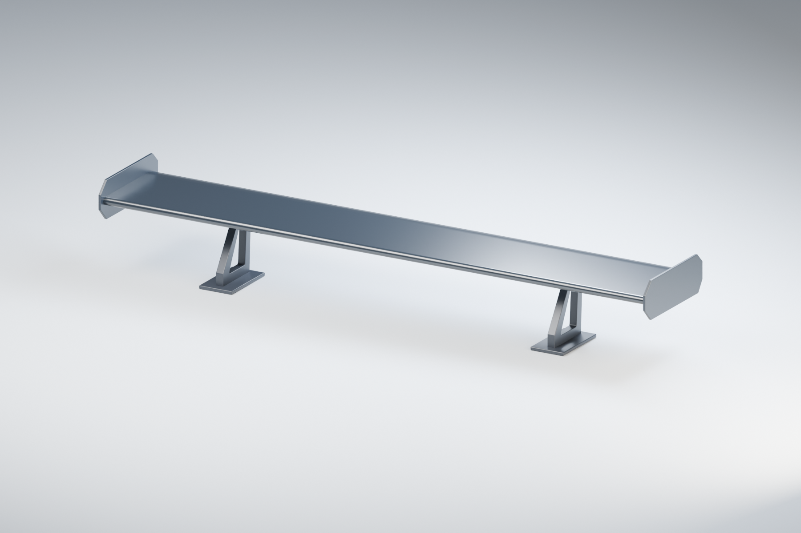
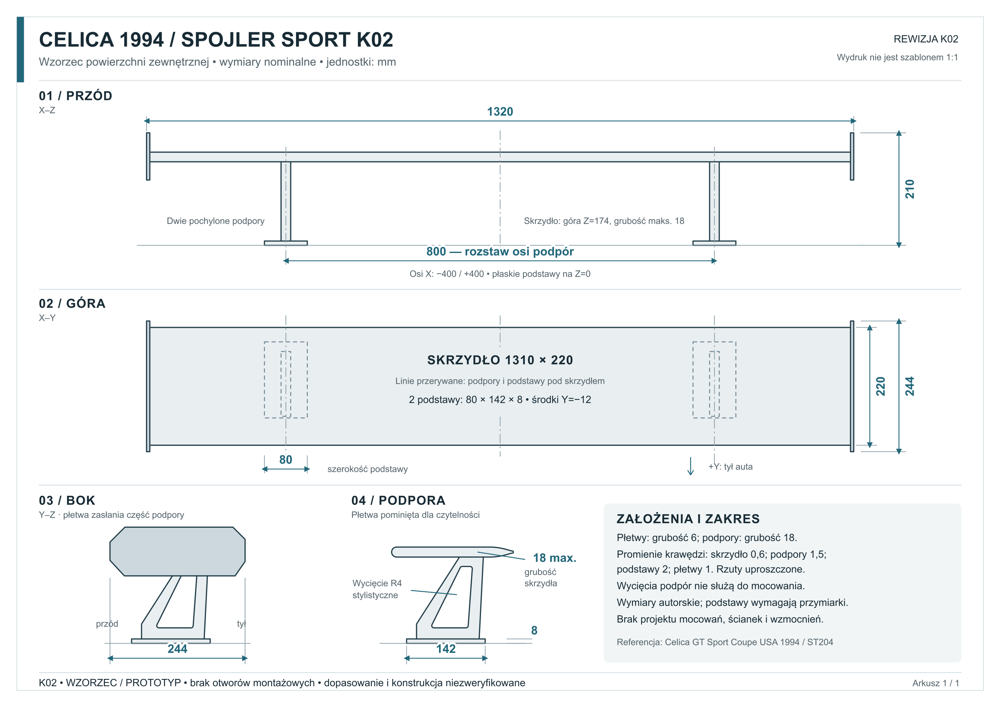

# Celica 1994 — spojler SPORT K02

Autorski model w skali **1:1**: proste sportowe skrzydło, dwie kanciaste płetwy boczne i dwie pochylone podpory z pojedynczym wycięciem. Czarne skrzydło ma połysk, podpory i płetwy — wykończenie satynowe. Materiały w scenie służą wizualizacji.

## Wymiary projektu

Wartości są **autorskimi wymiarami nominalnymi**, a nie wymiarami fabrycznego spojlera ani mocowania Toyota.

| Element | Wymiar [mm] |
|---|---:|
| Całość: rozpiętość × głębokość × wysokość | 1320 × 244 × 210 |
| Skrzydło: rozpiętość × głębokość | 1310 × 220 |
| Maksymalna grubość skrzydła | 18 |
| Górna powierzchnia skrzydła nad Z=0 | 174 |
| Krawędź spływu przed zaokrągleniem | 4 |
| Rozstaw osi podpór i podstaw | 800 |
| Położenie osi podpór w X | −400 / +400 |
| Grubość każdej podpory w X | 18 |
| Każda podstawa: szerokość × głębokość × grubość | 80 × 142 × 8 |
| Środek podstawy w Y | −12 |
| Płetwa boczna: obwiednia głębokość × wysokość; grubość | 244 × 88; 6 |
| Promień narożników wycięcia podpory w płaszczyźnie Y–Z | 4 |

Początek układu leży na Z=0, na osi symetrii auta. X biegnie w poprzek auta, Y ku tyłowi, Z do góry. Podstawy mają środki obrysu w **(−400, −12, 0)** i **(+400, −12, 0)**; podane Z wskazuje płaszczyznę dolną, nie środek bryły. Skrzydło zajmuje maksymalnie Z=156…174, płetwy Z=122…210. Dokładne obrysy podpór, wycięć i płetw zapisano w `parametry.json`.

Krawędzie są zaokrąglone: skrzydło 0,6 mm, podpory 1,5 mm, podstawy 2 mm, płetwy 1 mm. Rysunek pokazuje nominalne obrysy przed tymi lokalnymi zaokrągleniami. Wycięcia podpór mają narożniki R4 w płaszczyźnie Y–Z i dodatkowo zaokrąglone brzegi. Podstawy mają płaski styk na Z=0; jego pole jest mniejsze od obwiedni 80 × 142 mm. Wycięcia w podporach są elementem kształtu, **nie otworami montażowymi**.

## Pliki

- `Celica-1994-spojler-K02-Sport.blend` — model, edytowalne części źródłowe, materiały i scena podglądu.
- `eksporty/K02-sport-wzorzec-1do1-MILIMETRY.stl` — połączona bryła wzorcowa; przy imporcie wybierz **milimetry** i sprawdź obwiednię **1320 × 244 × 210 mm**.
- `rysunek-wymiarowy-K02.svg` — rzuty i wymiary kontrolne; wydruk nie jest szablonem 1:1.
- `podglady/` — pięć widoków modelu oraz rysunek w PNG.
- `parametry.json` i `build_spoiler.py` — parametry i odtwarzanie modelu, STL oraz pięciu widoków.
- `wymiary.json` — źródła danych, wymiary projektu i brakujące pomiary dopasowania.
- `kontrola-geometrii.json` — wyniki kontroli siatki, symetrii, obwiedni i eksportu.

Blender przechowuje geometrię w metrach i wyświetla milimetry. Eksport STL zawiera współrzędne w mm, ale sam format nie deklaruje jednostki. Podłoże, lampy i kamery nie należą do STL.

## Samochód referencyjny i dopasowanie

Referencją jest **Toyota Celica GT Sport Coupe, USA, rok modelowy 1994, rodzina ST204**. [Oryginalna broszura Toyota, archiwalna kopia, strona PDF 15](https://xr793.com/wp-content/uploads/2024/12/1994-Toyota-Celica.pdf#page=15) podaje długość 177,0 cala, szerokość 68,9 cala, rozstaw osi 99,9 cala i wysokość 51,0 cala, czyli około 4496 / 1750 / 2537 / 1295 mm. To dane nadwozia do oceny proporcji, **nie wymiary klapy lub mocowania**.

Model jest **wzorcem powierzchni zewnętrznej do oceny wyglądu i przymiarki**. Płaskie podstawy oraz rozstaw 800 mm wymagają sprawdzenia na konkretnym aucie. Nie dodano otworów mocujących. Przed wykonaniem części użytkowej należy dopasować powierzchnie styku, sprawdzić ruch klapy i dostęp od spodu oraz zaprojektować materiał, ścianki lub laminat, wzmocnienia i mocowanie.

Kontrola siatki nie potwierdza dopasowania, wytrzymałości ani właściwości aerodynamicznych. Model nie jest zatwierdzonym projektem części do jazdy.
